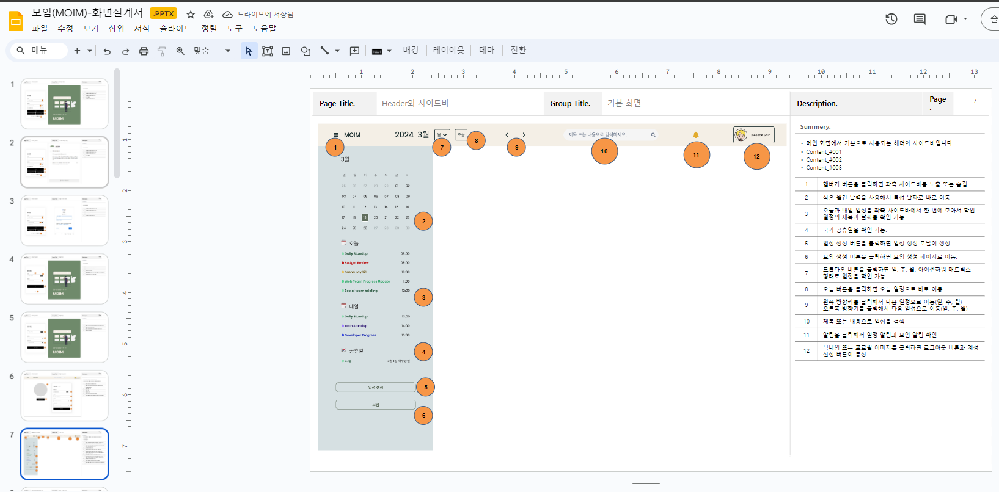
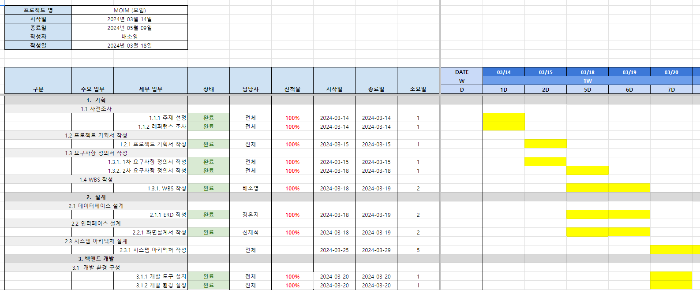

## 🙌🏻 서비스명 : 모임 (MOIM)

## 😁 팀원
 
|||||
|:---:|:---:|:---:|:---:|
| [장은지(팀장)](https://github.com/Jang-Eun-Ji) | [신재석(팀원)](https://github.com/MrKeeplearning) | [배소영(팀원)](https://github.com/qoth-0) | [한종승(팀원)](https://github.com/BellWin98)  |
</div>

<br>

## 💻 기술 스택

📱 **Front-End :** 

📀 **Back-end :** 


💾 **Infra & DB :**


🚀 **CI/CD :**


🔊 **Tools :**


<br>

## 📝 서비스 개요

### 1. 소개

> MOIM을 통해 일정을 우선순위에 따라 관리할 수 있고, 모임을 효율적으로 개설할 수 있습니다.

<br>

### 2. 목적 및 필요성
 - 등록된 일정들을 중요도와 긴급도에 따라 분류하고 싶다!
 - 사람들의 모임 시간을 조율하기가 너무 어렵다!

<br>

### 3. 주요 기능

- **모임 기능**
  - 호스트가 모임을 개설하면, 지정된 게스트들에게 모임 참여 요청 알림이 전송됩니다.
  - 호스트는 희망하는 모임 일정과 모임 시간의 범위를 설정할 수 있습니다.
  - 게스트들이 모임을 수락하면 일정 자동 추천 알고리즘을 통해 게스트들의 캘린더를 분석해서 모임 가능한 일정 중 가장 빠른 날짜와 시간을 추천합니다.

- **일정 등록/조회 기능**
  - 사용자는 중요도/긴급도에 따라 일정을 등록할 수 있습니다.
  - 등록된 일정을 4분면 매트릭스로 조회할 수 있습니다.
  - 4분면에 표시된 일정을 다른 분면으로 옮길 수 있습니다.
  - 일정을 월/주/일 단위로 조회할 수 있습니다.
 
- **알림 기능**
  - 등록된 일정이 임박했을 때, 일정 등록 시 설정했던 알림 시간에 알림을 전송할 수 있습니다. (10분 전, 1시간 전, 1일 전 등)
  - 모임 일정 자동 추천 알고리즘을 통해 모임 가능 일정이 추천되면 호스트와 게스트에게 모임 확정 알림이 전송됩니다.
 
- **키워드 검색 기능**
  - 사용자는 키워드(제목+메모)을 기준으로 일정을 검색할 수 있습니다.
  - 키워드 검색을 통해 일정 목록과 상세 내용을 확인할 수 있습니다.

<br>

## 📝 요구 사항 정의서(화면 클릭 시 이동)
[](https://docs.google.com/spreadsheets/d/e/2PACX-1vSTZa75qmkYYk5VZ6VWxN_7RTGlplStcqsQiXdpS9FOU4cicxamdVKAI-RX7qicB0TpfyUe9uzkrLFd/pubhtml?gid=0&single=true)

<br>

## ⚙️ ERD(화면 클릭 시 이동) 
[](https://www.erdcloud.com/d/3trf7ooZs6XS8PXTT)

<br>

## 📝 화면 설계서(화면 클릭 시 이동)
[](https://docs.google.com/presentation/d/e/2PACX-1vSx7kP_4zspTFpOuVhswRohKHU05I9Q4N4udH1Z0g22o24sg_w1F-Oq-9-aDzbzvA/pub?start=false&loop=false&delayms=3000)

<br>

## 🗓️ WBS(화면 클릭 시 이동)
[](https://docs.google.com/spreadsheets/d/e/2PACX-1vSTZa75qmkYYk5VZ6VWxN_7RTGlplStcqsQiXdpS9FOU4cicxamdVKAI-RX7qicB0TpfyUe9uzkrLFd/pubhtml?gid=1560823417&single=true)

<br>

## 📝 프로그램 사양서(화면 클릭 시 이동)
[](https://interesting-potential-90c.notion.site/9508b92f24254958b3b9f791d6583e3b?v=6fa037217d9b456cb709748c53281d5a&pvs=4)

<br>

## 🚀 시스템 아키텍쳐
### 📍Back-End


### 📍Front-End


<br>

## 📈 CI/CD 계획서

### 백엔드
#### 1. 시스템 개요
본 시스템은 고성능 및 확장 가능한 백엔드 서비스를 제공하기 위해 AWS 클라우드 서비스를 기반으로 구축되었습니다. Amazon EKS (Elastic Kubernetes Service)를 기반으로 EC2 인스턴스에서 실행되는 워커 노드, AWS Elastic Load Balancer를 통한 Route 53 연결, Amazon ElastiCache (Redis), Amazon RDS(MariaDB), DockerHub, 그리고 GitHub Actions를 이용한 CI/CD 자동화 프로세스를 포함합니다.

#### 2. 인프라 구성

##### 2.1 Amazon EKS (Elastic Kubernetes Service)
- 사용 목적
  - 컨테이너화된 애플리케이션의 배포, 관리, 확장을 위한 관리형 Kubernetes 서비스 사용
- 세부 구성
  - 마스터 노드: EKS가 관리하는 Kubernetes 컨트롤 플레인
  - 워커 노드: EC2 인스턴스에 배포된 애플리케이션을 실행하는 노드
- 유지보수 및 확장성
  - **컨테이너화**: 애플리케이션 및 서비스의 컨테이너화를 통해 배포, 확장 및 유지보수의 용이성 보장
  - **로드 밸런싱**: ALB를 통한 자동 로드 밸런싱과 트래픽 관리를 통해 시스템의 확장성 및 가용성 향상

##### 2.2 AWS Elastic Load Balancer & Route 53

- 사용 목적
  - 애플리케이션에 대한 트래픽 분산 및 도메인 이름을 통한 접근 관리
  
- 세부 구성:
   - Elastic Load Balancer (ELB): 인바운드 트래픽을 EKS 클러스터의 워커 노드에 자동으로 분산
   - Route 53: 사용자 정의 도메인 이름을 ELB와 연결하여 외부 접근성 향상**

##### 2.3 Amazon ElastiCache (Redis)
- 사용 목적: 이메일 인증을 위한 인증코드 저장 및 관리(검증완료 또는 유효시간 만료 시 인증코드 삭제)

##### 2.4 Amazon RDS (MariaDB) 
- 사용 목적: 관계형 데이터베이스를 사용하여 사용자, 일정, 모임 등 주요 데이터를 저장

##### 2.5 DockerHub

- 사용 목적: 애플리케이션 컨테이너 이미지의 저장 및 버전 관리
- 세부 구성: 공개 또는 비공개 리포지토리 설정, 이미지 푸시 및 풀 관리

##### 2.6 GitHub Actions

- 사용 목적: 코드 변경에 따른 자동화된 CI/CD 파이프라인 구현
  
- 세부 구성
    - CI (Continuous Integration): 코드 커밋 및 푸시 시 자동 빌드 및 테스트 실행
    - CD (Continuous Deployment): 테스트 성공 시 DockerHub로 컨테이너 이미지를 자동 배포 및 EKS 클러스터에 롤아웃

#### 3. 보안 및 네트워크 설계

##### 3.1 네트워크 보안

- 목적
  - 시스템의 보안 강화 및 민감한 데이터 보호
  
- 구현
    - IAM (Identity and Access Management): EKS, EC2, ElastiCache 및 기타 AWS 서비스에 대한 접근 권한 관리
    - 보안 그룹 및 네트워크 ACLs: EC2 인스턴스 및 ElastiCache 클러스터에 대한 인바운드 및 아웃바운드 트래픽 제어
 
<br>

### 프론트엔드

#### 1. 시스템 개요
본 시스템은 프론트엔드 정적 웹 애플리케이션의 CI/CD 파이프라인 구축과 높은 가용성, 보안을 위한 구성을 목표로 합니다. 
GitHub 저장소에 코드 변경이 발생할 때마다 자동으로 빌드 및 배포 프로세스가 실행되어 Amazon S3에 정적 웹사이트를 호스팅합니다.
Amazon CloudFront를 통해 전 세계에 콘텐츠를 빠르게 제공하며, AWS Certificate Manager(ACM)에서 발급받은 SSL 인증서를 적용하여 HTTPS를 통한 안전한 접근을 보장합니다.
Amazon Route 53은 도메인 이름 시스템(DNS) 서비스를 제공하여 사용자가 웹 애플리케이션에 쉽게 접근할 수 있도록 합니다.
    
#### 2. 인프라 구성
- **GitHub Actions**: GitHub 저장소에 코드 변경이 감지되면 자동으로 빌드 및 배포 프로세스를 실행
- **Amazon S3 버킷**: 빌드된 정적 파일을 호스팅
- **AWS Certificate Manager**: SSL 인증서를 관리. 인증서는 CloudFront 배포에 연결하여 HTTPS 통신을 가능하게 함
- **Amazon CloudFront**: S3 버킷에 호스팅된 정적 웹사이트 앞에 위치하는 CDN 서비스로, 캐싱을 통해 전 세계적으로 빠른 콘텐츠 제공을 가능하게 하며, ACM에서 발급받은 SSL 인증서를 사용하여 안전한 HTTPS 연결을 제공
- **Amazon Route 53**: 웹 애플리케이션의 도메인 이름을 관리하고, CloudFront 배포와 매핑하여 사용자가 웹 애플리케이션에 쉽게 접근할 수 있도록 함
 
<br>


## 📝 단위 테스트 결과서(화면 클릭 시 이동)
[링크 클릭](assets/uxui_test/test)

## 📝 화면 테스트
- 캘린더
  [링크 클릭](assets/uxui_test/calendar)

- 아이젠하워
  [링크 클릭](assets/uxui_test/eisenhower)

- 모임 기능
 [링크 클릭](assets/uxui_test/group)

- 로그인
[링크 클릭](assets/uxui_test/login)

- 알림
[링크 클릭](assets/uxui_test/notification)

- 로그인
[링크 클릭](assets/uxui_test/search)

<br>


## 🏠 기술 사용 이유

| **Java 17** | **Spring Boot** |
| --- | --- |
| 설명1 | 설명2 |

| **Spring Data Jpa** | **Redis** |
| --- | --- |
| 설명3 | 설명4 |

<br>

## 📄 커밋 컨벤션 및 Github Flow

| 이름 | 설명 |
| --- | --- |
| feat | 기능 커밋 |
| fix | 오류 수정 커밋 |
| refactor | 패키지 구조 수정 |
| test | 테스트 커밋 |
| chore | 그 외 자잘한 수정 |


<br>


# moim-front

## Project setup
```
npm install
```

### Compiles and hot-reloads for development
```
npm run serve
```

### Compiles and minifies for production
```
npm run build
```

### Lints and fixes files
```
npm run lint
```

### Customize configuration
See [Configuration Reference](https://cli.vuejs.org/config/).
